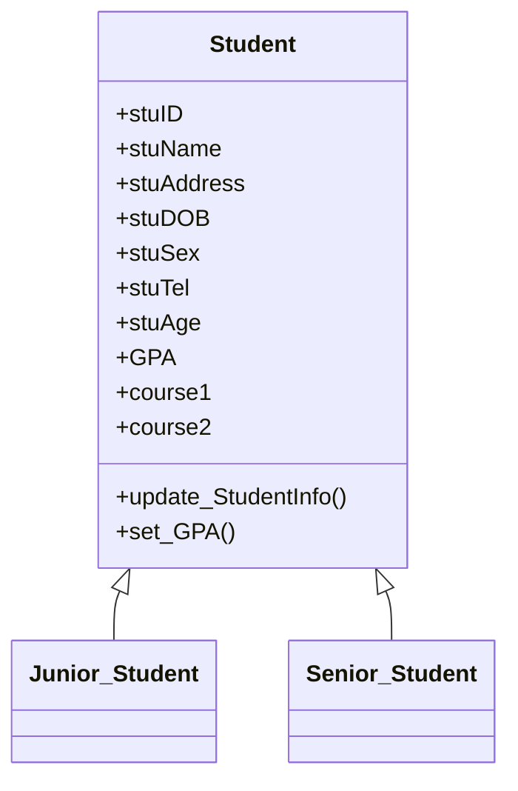
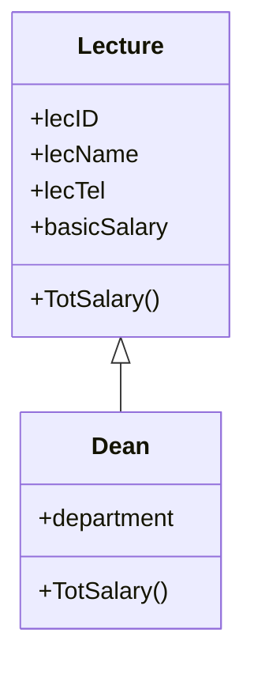
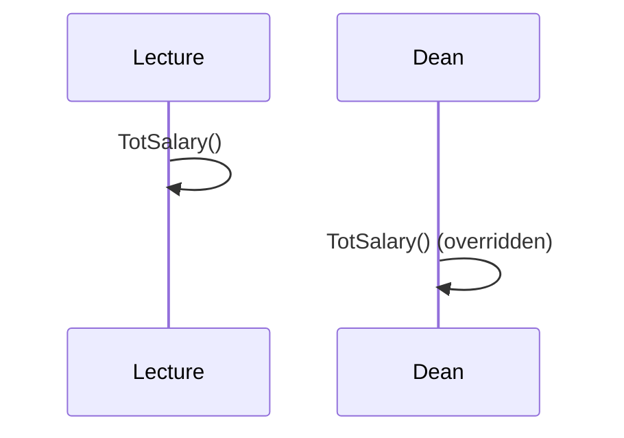

# Student Management System (Java OOP)

A console-based **Student Management System** for a university environment, designed to demonstrate **Java OOP concepts** such as abstraction, encapsulation, inheritance, and polymorphism.

## What This Project Covers

This project showcases core Java OOP concepts through a university student management domain:

- **Abstraction**: Common student behaviors and attributes are grouped in base classes.
- **Encapsulation**: Student data is wrapped inside classes and accessed/updated through methods.
- **Inheritance**: Specialized student types and staff roles extend base classes.
- **Polymorphism**: Overridden methods enable different behaviors for related classes.

## OOP Concepts in This Project

### 1) Abstraction
The system abstracts common properties and behaviors into base classes such as `Student` and `Lecture`, allowing specialized classes to focus only on their unique behavior.

**Example:**  
`Student` holds shared fields like ID, name, address, GPA, and courses.  
`Junior_Student` and `Senior_Student` only add their own extra details.



---

### 2) Encapsulation
Student data is stored inside classes and modified through methods like `update_StudentInfo()` and `set_GPA()`. This demonstrates controlled access to fields and behavior.

**Example:**  
`set_GPA()` allows updating GPA while keeping the data within the class.

```mermaid
flowchart TB
  A[Student Object] --> B[Private Data Fields]
  B --> C[Methods: update_StudentInfo(), set_GPA()]
  C --> D[Controlled Updates]
```

---

### 3) Inheritance
Specialized classes extend base classes to reuse and expand behavior.

**Examples:**
- `Junior_Student` and `Senior_Student` extend `Student`
- `Dean` extends `Lecture`



---

### 4) Polymorphism
Methods like `TotSalary()` are overridden in subclasses such as `Dean`, enabling different salary calculations while sharing the same method signature.



---

## Project Structure (based on `Main.java`)

Key entities modeled:

- **Student**: Base class with common student details and GPA
- **Junior_Student**: Extends Student, includes parent/guardian info
- **Senior_Student**: Extends Student, includes batch referee
- **Parent**: Holds parent/guardian data
- **Courses**: Course details like ID, description, and duration
- **Batch_Refree**: Referee details for senior students
- **Lecture**: Lecturer data with salary and allowances
- **Dean**: Extends Lecture, adds dean-specific info
- **Student_Registration**: Connects student with registration info
- **Reports**: Academic report information
- **Projects**: Group project management for students

## How It Works

The `Main` class:

- Creates **sample objects** for students, courses, staff, registrations, reports, and projects.
- Provides a **console menu** to perform:
  - Display student details
  - Update student GPA
  - Update student information
  - View details of parents, batch referees, lecturers, registrations, courses, reports, and projects

### Example Console Features

- **Display student details** (Junior or Senior)
- **Update GPA** for any student
- **Change student personal data and courses**
- **Print reports, registration info, project memberships**

## How to Run

### Prerequisites
- Java 8 or higher installed

### Run in Terminal

```bash
# Compile
javac Main.java

# Run
java Main
```

### Run in IDE
Open the project in any Java IDE (e.g., IntelliJ IDEA, Eclipse, NetBeans), then run `Main.java`.

## Notes

- This project is **fully console-based**.
- It focuses on **OOP structure** rather than persistence or UI.
- Data is **hard-coded** in `Main.java` for learning/demo purposes.

---

If you'd like, I can also add screenshots, contribution guidelines, or a more detailed class diagram once you share more files.
